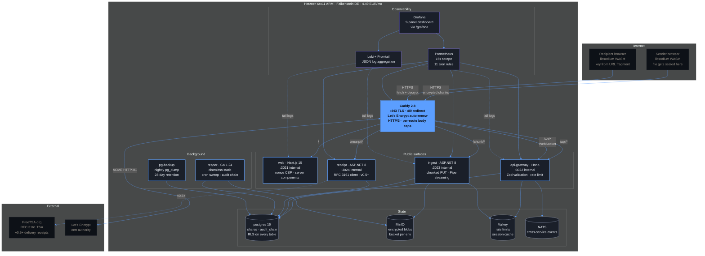

# Architecture

SlothBox is a 14-service monorepo. Everything runs in Docker Compose locally and
in production (one Hetzner cax11 ARM box in Falkenstein, DE for v0.1).

## System diagram



The trust property the architecture enforces: **the sender's key never reaches
the server.** It's generated client-side via libsodium's `randombytes_buf`,
embedded in the URL fragment, and the recipient's browser reads it via
`window.location.hash` — which browsers never include in HTTP requests by spec.

## Service map

| Service         | Language             | Purpose                                                                     |
| --------------- | -------------------- | --------------------------------------------------------------------------- |
| **web**         | TypeScript / Next 15 | Frontend — drag-drop UI, encryption in browser, share link, decryption page |
| **api-gateway** | TypeScript / Hono    | Auth, share CRUD, WebSocket progress, rate limiting                         |
| **ingest**      | C# / ASP.NET Core 8  | Chunked encrypted-blob upload to MinIO                                      |
| **receipt**     | C# / ASP.NET Core 8  | RFC 3161 timestamp client, Merkle log writer (v0.5+)                        |
| **reaper**      | Go                   | Expiry sweep, audit chain extension                                         |
| **postgres**    | Postgres 16          | Metadata only (shares, audit log). Never plaintext.                         |
| **minio**       | MinIO                | Encrypted blob storage                                                      |
| **valkey**      | Valkey               | Cache + queue + sessions                                                    |
| **nats**        | NATS                 | Pub/sub for cross-service events and WebRTC signaling (v1.1)                |
| **caddy**       | Caddy                | Reverse proxy + auto-HTTPS                                                  |
| **prometheus**  | Prometheus           | Metrics scraping                                                            |
| **grafana**     | Grafana              | Dashboards                                                                  |
| **loki**        | Loki + Promtail      | Log aggregation                                                             |

## Data flow — uploading a file (v0.1)

```
1. User drops file in browser
2. Browser generates random key (libsodium randombytes_buf)
3. Browser encrypts file in chunks (XChaCha20-Poly1305)
4. Browser POSTs metadata to api-gateway → gets share ID + upload URL
5. Browser uploads chunks to ingest service → ingest streams to MinIO
6. Browser receives confirmation
7. Browser generates share URL: https://slothbox.com/s/{shareId}#{base64Key}
8. User copies and shares the URL
```

The encryption key never leaves the browser in the upload path. The URL fragment
(`#{base64Key}`) is generated client-side and is not sent to any server when the
recipient clicks the link.

## Data flow — downloading

```
1. Recipient opens https://slothbox.com/s/{shareId}#{base64Key}
2. Browser fetches metadata from api-gateway using shareId only
3. Browser fetches encrypted chunks from ingest service
4. Browser extracts key from URL fragment (window.location.hash)
5. Browser decrypts chunks (libsodium AEAD)
6. Browser saves the decrypted file via Blob + download link
7. If burn-after-read: browser POSTs deletion request → ingest deletes from MinIO,
   reaper extends the audit chain with the deletion event
```

## Network boundaries

```
                 Internet
                    │
                    ▼
           ┌──────────────┐
           │    Caddy     │  TLS termination, security headers
           └──────┬───────┘
                  │ (port 443 only public)
       ┌──────────┼──────────────┐
       │          │              │
       ▼          ▼              ▼
   web:3021  gateway:3022   ingest:3023
                  │
       ┌──────────┼──────────────┬──────────┐
       │          │              │          │
       ▼          ▼              ▼          ▼
   postgres   valkey/nats     minio    receipt:3024
   (internal network only — not exposed publicly)
```

Only Caddy is exposed publicly. Everything else lives on the `internal` Docker
network. Postgres, MinIO, Valkey, NATS are not reachable from the internet.

## Why these picks

See the README for the per-language justification. Highlights:

- **C# for ingest** because Kestrel + PipeReader handles multi-GB chunked uploads
  with backpressure better than Node streams, and ImageSharp is the strongest
  image library for thumbnail generation.
- **Go for reaper** because cron-style daemons benefit from Go's static binary
  and ~8 MB RAM footprint.
- **Self-hosted Postgres + MinIO** instead of managed equivalents because this
  project demonstrates "I can run my own infrastructure" — your portfolio already
  shows managed Supabase via SlothCV.
- **Drizzle instead of Prisma** because it is edge-runtime compatible and
  produces SQL closer to what's actually executed.

## Future scalability

| Bottleneck at 10x users   | Mitigation                                             |
| ------------------------- | ------------------------------------------------------ |
| Single Hetzner box CPU    | Scale up to CCX23 / CCX33                              |
| Postgres write throughput | Read replica + tune connection pool                    |
| MinIO disk capacity       | Attach Hetzner Storage Box for cold storage            |
| WebSocket connections     | Scale out api-gateway pods behind Caddy load-balancing |

| Bottleneck at 100x users | Mitigation                                                            |
| ------------------------ | --------------------------------------------------------------------- |
| Single-region latency    | Add edge regions on Fly.io for the frontend, keep backend in EU       |
| Postgres single primary  | Switch to managed (Neon, Supabase) or Patroni cluster                 |
| Ingest disk bandwidth    | Dedicated ingest box, chunked upload direct to S3 with presigned URLs |
| Reaper coordination      | Replace cron with NATS JetStream consumer groups                      |

None of these are surprises. All known migration paths.

## Deployment topology (production)

```
┌──────────────────────────────────────────────────────┐
│  Hetzner cax11 ARM (Falkenstein DE) — 4.49 EUR/mo    │
│  ┌────────────────────────────────────────────────┐  │
│  │  docker-compose.prod.yml                       │  │
│  │  ┌────────┐ ┌─────────┐ ┌──────┐ ┌──────────┐ │  │
│  │  │ caddy  │ │ web     │ │ api  │ │ ingest   │ │  │
│  │  └────────┘ └─────────┘ └──────┘ └──────────┘ │  │
│  │  ┌────────┐ ┌─────────┐ ┌──────┐ ┌──────────┐ │  │
│  │  │ minio  │ │ postgres│ │valkey│ │ nats     │ │  │
│  │  └────────┘ └─────────┘ └──────┘ └──────────┘ │  │
│  │  ┌────────┐ ┌─────────┐ ┌──────┐ ┌──────────┐ │  │
│  │  │ reaper │ │ receipt │ │grafana│ │prometheus│ │  │
│  │  └────────┘ └─────────┘ └──────┘ └──────────┘ │  │
│  │  ┌────────┐ ┌─────────┐                       │  │
│  │  │ loki   │ │promtail │                       │  │
│  │  └────────┘ └─────────┘                       │  │
│  └────────────────────────────────────────────────┘  │
└──────────────────────────────────────────────────────┘
        │                                       │
        ▼                                       ▼
   Hetzner Storage Box              FreeTSA.org (RFC 3161)
   (encrypted backups)              (timestamp authority)
```

See [`RUNBOOK.md`](RUNBOOK.md) for the deployment procedure.
